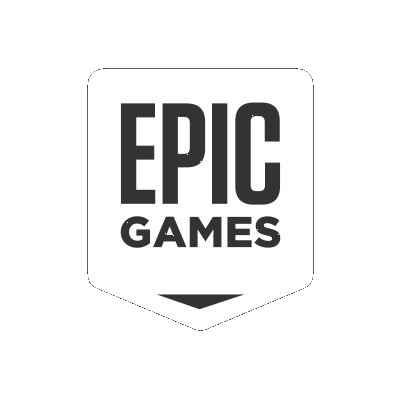
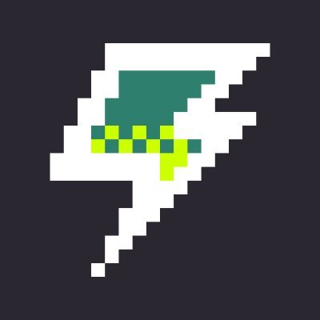
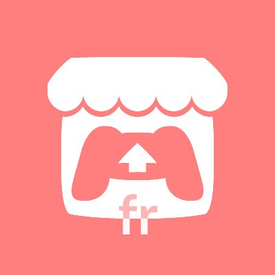

<html><head></head><body>

## 📝 How to create your Lyna page ?
1. Start by forking the project from its Github repository.
2. Clone the forked project onto your local machine.
3. Navigate to the project's directory and run `npm install` to install all the necessary dependencies.
4. After the dependencies are installed, run `npm run gui` to start the development environment.
5. Once you have made your desired changes, create a pull request to merge your changes into the main branch.
6. Open your web browser and visit `https://lyna.taistudio.fr/YOUR_USER_NAME` to see your page live.
7. Enjoy your custom Lyna page!

## ⚙️ Supported services

 

## 📷 ScreenShots

    
    
    
    

</body></html>
