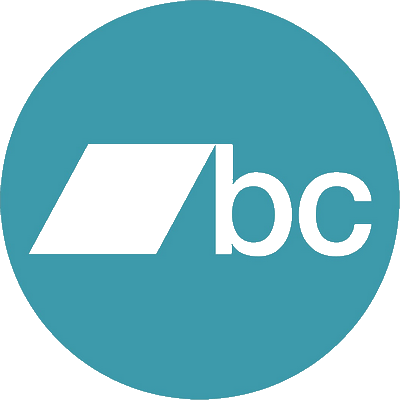
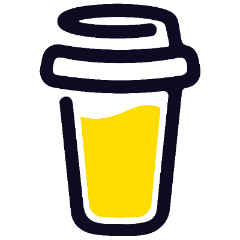
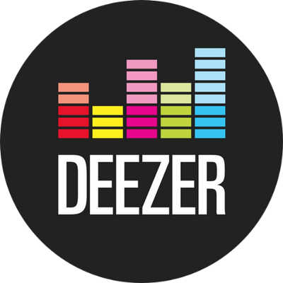
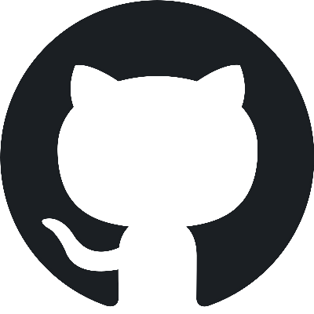
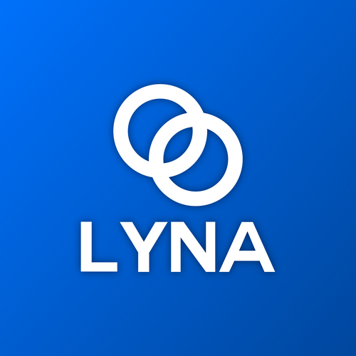
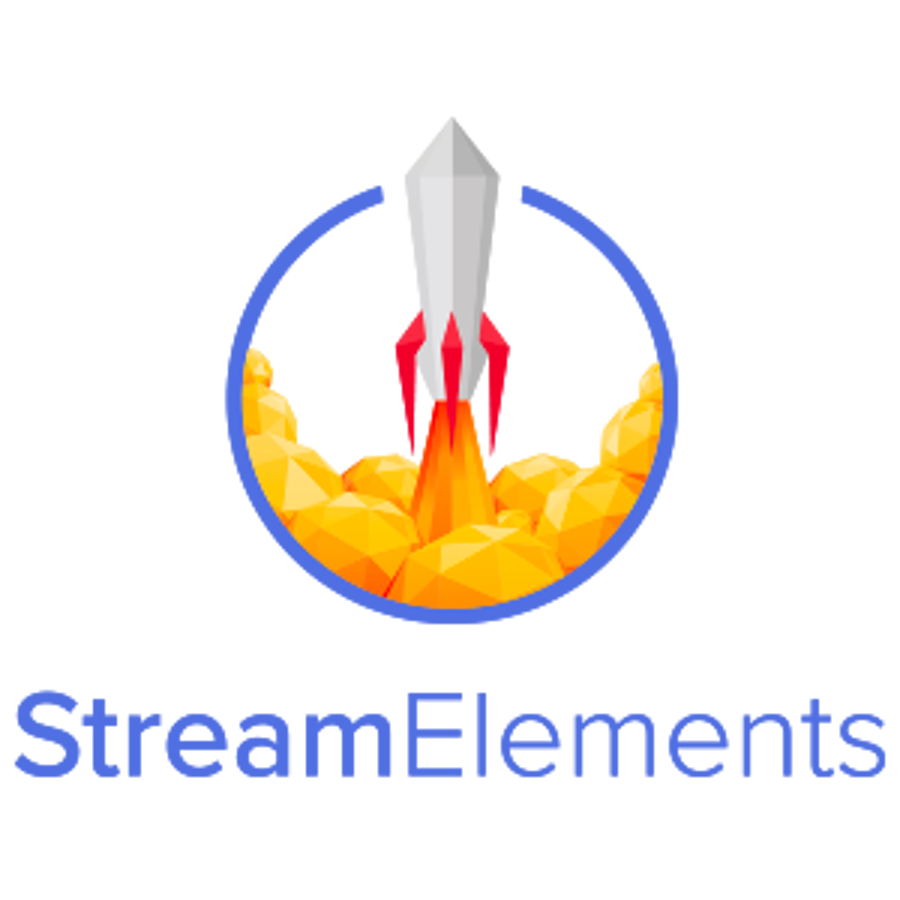
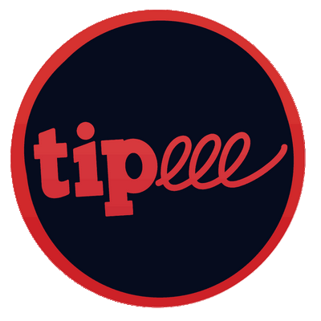
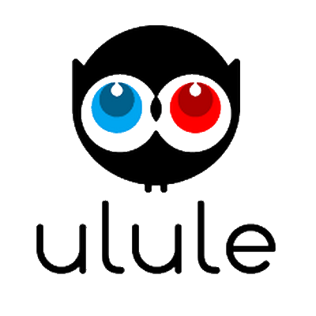

<html><head></head><body>

## 📝 How to create your Lyna page ?

1. Fork the project
2. Clone on your pc
3. run `npm install`
4. run `npm run gui`
5. create an pull request
6. open your web browser on `https://lyna.ga/YOUR_USER_NAME`
7. enjoy

## ⚙️ Supported services

 

## 📷 ScreenShots

    
    
    
    

</body></html>